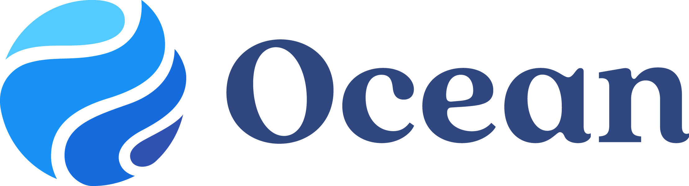
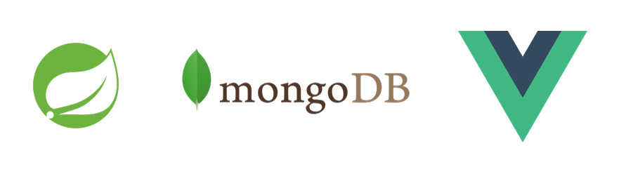

# Bridging the Gap between Patients and Healthcare Providers: My Return to OceanMD (formerly CognisantMD).
_April 21, 2023_

## Introduction
As I sit down to write this blog post, I can't help but reflect on how much I've learned since my first co-op internship at OceanMD. Once again, I'm grateful to be part of the Developer team, working alongside the recently promoted VP of R&D, Jonathan Fishbein, as a Software Engineer.

## About OceanMD
As a returning intern, I've been able to delve even deeper into OceanMD's flagship product, Ocean. This cloud-based platform continues to impress me with its ability to improve healthcare delivery by enabling secure sharing of health information for clinical use, administration, referrals, and research. With Ocean Tablets, Ocean Online Messages, and an extensive library of forms and questionnaires, the platform is a powerful tool for connecting patients, primary care providers, specialists, and other healthcare stakeholders.

## Job Details
Further to my return working as a Software Engineer, I focused on developing full-stack features for the Ocean Platform utilizing Vue and Java Spring. This involved designing, collaborating, developing, and testing the feature within three-week sprints. Furthermore, I also had the opportunity to work on security and privacy aspects of the product: debugging network requests and data partitioning based on authorization to name a few.

Coming back to OceanMD reminded me of how impactful Ocean's technology really is: empowering patients to share health information with their physicians on a whim, the ability to book appointments without the need for phone calls, I could go on and on! Along with this, the culture here is incredible: a team of passionate, intelligent, and supportive developers full of banter is all you need for an entertaining time at work.

---
## **Winter 2023 Goals**

### Improve my ability to work in a team environment

- I chose to pick-up collaborative tasks that were to be worked in parallel with the team. While working with my peers, I communicated my efforts on the project with my co-workers, including testing procedures, reviewing and pair-programming to ensure the best possible result. This process helped me understand how to collaborate with people and how to deliver on expectations, as a collaborative task required team members to work in tandem in order to produce results.

### Build a decent understanding of system design

- Throughout my internship, I made sure to ask questions regarding the design of features provided by the application. For instance, why use horizontal scaling versus vertiical scaling, dependency injections for better unit testing, SOLID principles, etc. These questions not only taught me more about software design, but introduced me to an entire new world of technology. With this, I was able to familiarize myself with what was best practice when it came to designing an application in the long run versus just for a short-while.

### Become acquainted with security measures in technology

- Through picking up tickets relating to security, and asking clarifying questions to my team regarding hashing procedures, encrypting data, etc. I was able to improve my understanding of securing applications and ensuring privacy measures are present when features are pushed. I also participated in Immersive Labs tutorials to learn common approaches to security and privacy regarding web apps and products. From this, I found myself improving at code refactoring and knowing what to ask in order to resolve mishaps.

---
## Conclusion

To reiterate, OceanMD is not just a company, it is also a close-knit community of individuals who are committed to improving patient charting and clinical decision support through EMR-integrated solutions. During my time collaborating with a team of talented professionals, I learned that software design is not just about technical specifications, but also about the underlying purpose and intent behind it. My experience with OceanMD was truly amazing and it's hard to put into words how much I valued working with them.

## Acknowledgments

Of the many acknowledgements, I thank OceanMD's VP of R&D, Jonathan Fishbein, for taking a chance with me again as their winter semester intern, as well as the co-workers I had the pleasure of working with along the way. 👋😄
